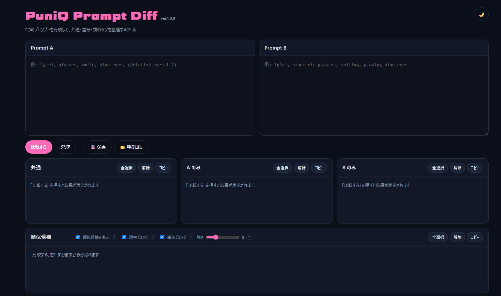

# 🎀 PuniQ Prompt Diff

🌸 Stable Diffusion などのAI画像生成で使うプロンプトを、2つ並べて比較・整理できる静的Webアプリです。  
共通タグ、片方だけにあるタグ、類似候補、重複、ウェイト違いを見つけて、プロンプトの差分整理をスムーズにします。

## [☕ Support on Ko-fi](https://ko-fi.com/puniq)

[日本語](#jp-日本語) | [English](#en-english) | [繁體中文](#tw-繁體中文台灣) | [Español](#es-español)

---

## JP 日本語

### これは何？

**PuniQ Prompt Diff** は、AI画像生成用のプロンプトを2つ比較して、共通点や差分を見つけるためのツールです。

Prompt A と Prompt B を貼り付けると、タグを分解して **共通 / Aのみ / Bのみ / 類似候補 / 重複 / ウェイト違い** に整理します。  
プロンプトを微調整したあと、「どこが変わった？」「どのタグが重複してる？」を確認したいときに便利です。

> 💡 **プロンプトとは？** AIに絵を描いてもらうときに入力するテキストのことです。`1girl, smile, blue eyes, detailed background` のように、カンマ区切りのタグとして扱われることが多いです。

---

### ✨ 主な機能

- ✅ 2つのプロンプトを比較して、共通タグ・差分タグを抽出
- 🔍 Aのみ / Bのみのタグから、誤字や表記ゆれっぽい類似候補を表示
- 🧩 Prompt A内 / Prompt B内の重複タグを検出
- ⚖️ `(tag:1.2)` のようなウェイト違いを検出
- 🧹 選択タグ、共通タグ、重複タグを削除してプレビュー
- 📋 各結果や削除後プレビューをコピー
- 💾 比較セットをブラウザ内に保存・呼び出し
- 🌙 ライト / ダークテーマ切替

---

### 🧑‍🏫 かんたんな使い方

1. 🌐 `index.html` をブラウザで開きます。
2. 📝 `Prompt A` と `Prompt B` に比較したいプロンプトを貼り付けます。
3. 🔎 `比較する` を押すと、共通タグ・差分タグ・類似候補が表示されます。
4. 🧩 `A内重複` / `B内重複` で、同じタグの重複を確認します。
5. ⚖️ `ウェイト違い` で、同じタグ名でも強度が違うものを確認します。
6. 🧹 削除したいタグを選ぶと、下のプレビューに反映されます。
7. 📋 必要な結果やプレビューをコピーして、生成ツール側に貼り付けます。
8. 💾 よく比較する組み合わせは、`保存` からセットとして残せます。

---

### 🔒 データ保存について

- 比較セットはブラウザの `localStorage` に保存されます。
- 保存キーは `puniq_prompt_diff_saved_sets` です。
- 保存できる比較セットは最大20件です。
- プロンプト内容は外部サーバーへ送信されません。

> ⚠️ ブラウザのデータを削除すると、保存した比較セットも消えます。大事なプロンプトは別途バックアップしてください。

---

### 🚀 GitHub Pagesで使う

このリポジトリをGitHub Pagesで公開すると、`index.html` をそのままWebアプリとして利用できます。  
ビルドや `npm install` は不要です。

---

### 📦 ファイル構成

- `index.html` : UI、スタイル、アプリロジックを含む本体ファイル
- `README.md` : この説明ファイル

---

### ☕ Support

このプロジェクトが役に立った場合は、Ko-fiで今後の開発を応援していただけると嬉しいです。

☕ https://ko-fi.com/puniq

ご支援ありがとうございます！

---

### ライセンス

MIT License © 2026 PuniQ

---

## EN English

### What is this?

**PuniQ Prompt Diff** is a small web app for comparing two AI image generation prompts.

Paste Prompt A and Prompt B, and the app separates their tags into **common tags, A-only tags, B-only tags, similar candidates, duplicates, and weight changes**.  
It is useful when you tweak a prompt and want to see exactly what changed.

> 💡 **What is a prompt?** It is the text you give to an AI image generator, often written as comma-separated tags such as `1girl, smile, blue eyes, detailed background`.

---

### ✨ Features

- ✅ Compare two prompts and extract common / different tags
- 🔍 Find similar candidates that may be typos or wording variations
- 🧩 Detect duplicate tags inside Prompt A or Prompt B
- ⚖️ Detect weight changes such as `(tag:1.2)`
- 🧹 Select tags to remove and preview the cleaned prompt
- 📋 Copy each result group or the cleaned preview
- 💾 Save and load comparison sets in your browser
- 🌙 Light / dark theme toggle

---

### 🧑‍🏫 Simple How to Use

1. 🌐 Open `index.html` in your browser.
2. 📝 Paste your text into `Prompt A` and `Prompt B`.
3. 🔎 Press `Compare` to show common tags, differences, and similar candidates.
4. 🧩 Check `Duplicates in A` / `Duplicates in B` for repeated tags.
5. ⚖️ Check `Weight Changes` for tags with different strengths.
6. 🧹 Select tags to remove and preview the result.
7. 📋 Copy the result or preview back into your image generation tool.
8. 💾 Save frequently used comparisons as sets.

---

### 🔒 Data Storage

- Saved comparison sets are stored in browser `localStorage`.
- Storage key: `puniq_prompt_diff_saved_sets`
- Up to 20 comparison sets can be saved.
- Prompt text is not sent to an external server.

> ⚠️ Clearing your browser data will delete saved sets. Keep separate backups for important prompts.

---

### 🚀 Use with GitHub Pages

Publish this repository with GitHub Pages and `index.html` will work as a web app.  
No build step or `npm install` is required.

---

### 📦 Project Files

- `index.html` : Main UI, styles, and app logic
- `README.md` : This documentation

---

### ☕ Support

If you find this project useful and would like to support future development, you can support me on Ko-fi.

☕ https://ko-fi.com/puniq

Thank you for your support!

---

### License

MIT License © 2026 PuniQ

---

## TW 繁體中文台灣

### 這是什麼？

**PuniQ Prompt Diff** 是一個用來比較兩組 AI 圖像生成提示詞的輕量網頁工具。

貼上 Prompt A 和 Prompt B 後，它會把標籤整理成 **共同標籤 / 只有A有 / 只有B有 / 相似候選 / 重複 / 權重差異**。  
當你微調提示詞後，想確認「到底改了哪裡」時會很方便。

> 💡 **什麼是提示詞？** 就是給 AI 圖像生成工具的文字指令，常見格式是像 `1girl, smile, blue eyes, detailed background` 這樣用逗號分隔的標籤。

---

### ✨ 主要功能

- ✅ 比較兩組提示詞，抽出共同標籤與差異標籤
- 🔍 從 A-only / B-only 中找出可能的錯字或表記差異
- 🧩 偵測 Prompt A / Prompt B 內部的重複標籤
- ⚖️ 偵測 `(tag:1.2)` 這類權重差異
- 🧹 選擇要刪除的標籤並預覽整理後的提示詞
- 📋 複製各區塊結果或整理後預覽
- 💾 在瀏覽器中保存與載入比較組合
- 🌙 淺色 / 深色主題切換

---

### 🧑‍🏫 簡單使用方式

1. 🌐 用瀏覽器開啟 `index.html`。
2. 📝 將要比較的內容貼到 `Prompt A` 和 `Prompt B`。
3. 🔎 按下 `比較する`，顯示共同標籤、差異與相似候選。
4. 🧩 在 `A内重複` / `B内重複` 查看重複標籤。
5. ⚖️ 在 `ウェイト違い` 查看權重不同的標籤。
6. 🧹 選擇想刪除的標籤，下方會顯示整理後預覽。
7. 📋 複製結果或預覽，貼回圖像生成工具。
8. 💾 常用的比較內容可用 `保存` 儲存成組合。

---

### 🔒 資料儲存

- 比較組合會儲存在瀏覽器的 `localStorage`。
- 儲存鍵值：`puniq_prompt_diff_saved_sets`
- 最多可保存 20 組比較內容。
- 提示詞內容不會傳送到外部伺服器。

> ⚠️ 清除瀏覽器資料時，保存的比較組合也會消失。重要提示詞請另外備份。

---

### 🚀 使用 GitHub Pages

將此儲存庫發布到 GitHub Pages 後，`index.html` 可以直接作為網頁應用程式使用。  
不需要建置，也不需要執行 `npm install`。

---

### 📦 專案檔案

- `index.html` : 主要 UI、樣式與應用邏輯
- `README.md` : 本說明文件

---

### ☕ Support

如果這個專案對您有幫助，歡迎透過 Ko-fi 支持後續開發。

☕ https://ko-fi.com/puniq

感謝您的支持！

---

### 授權條款

MIT License © 2026 PuniQ

---

## ES Español

### ¿Qué es esto?

**PuniQ Prompt Diff** es una pequeña aplicación web para comparar dos prompts de generación de imágenes con IA.

Pega Prompt A y Prompt B, y la aplicación separará las etiquetas en **comunes, solo en A, solo en B, candidatas similares, duplicadas y cambios de peso**.  
Es útil cuando ajustas un prompt y quieres ver exactamente qué cambió.

> 💡 **¿Qué es un prompt?** Es el texto que se le da a una herramienta de generación de imágenes con IA. A menudo se escribe como etiquetas separadas por comas, por ejemplo `1girl, smile, blue eyes, detailed background`.

---

### ✨ Funciones principales

- ✅ Comparar dos prompts y extraer etiquetas comunes y diferentes
- 🔍 Encontrar candidatas similares que pueden ser errores o variaciones de texto
- 🧩 Detectar etiquetas duplicadas dentro de Prompt A o Prompt B
- ⚖️ Detectar cambios de peso como `(tag:1.2)`
- 🧹 Seleccionar etiquetas para eliminar y previsualizar el prompt limpio
- 📋 Copiar cada grupo de resultados o la vista previa limpia
- 💾 Guardar y cargar conjuntos de comparación en el navegador
- 🌙 Cambiar entre tema claro y oscuro

---

### 🧑‍🏫 Uso sencillo

1. 🌐 Abre `index.html` en tu navegador.
2. 📝 Pega el texto en `Prompt A` y `Prompt B`.
3. 🔎 Pulsa `比較する` para ver etiquetas comunes, diferencias y candidatas similares.
4. 🧩 Revisa `A内重複` / `B内重複` para encontrar etiquetas repetidas.
5. ⚖️ Revisa `ウェイト違い` para ver etiquetas con pesos distintos.
6. 🧹 Selecciona etiquetas para eliminarlas y mira la vista previa.
7. 📋 Copia el resultado o la vista previa en tu herramienta de generación de imágenes.
8. 💾 Guarda comparaciones frecuentes como conjuntos.

---

### 🔒 Almacenamiento de datos

- Los conjuntos guardados se almacenan en `localStorage` del navegador.
- Clave de almacenamiento: `puniq_prompt_diff_saved_sets`
- Se pueden guardar hasta 20 conjuntos de comparación.
- El texto de los prompts no se envía a servidores externos.

> ⚠️ Si borras los datos del navegador, también se eliminarán los conjuntos guardados. Guarda copias aparte de tus prompts importantes.

---

### 🚀 Usar con GitHub Pages

Publica este repositorio con GitHub Pages y `index.html` funcionará directamente como una aplicación web.  
No se necesita compilación ni `npm install`.

---

### 📦 Archivos del proyecto

- `index.html` : Interfaz principal, estilos y lógica de la app
- `README.md` : Esta documentación

---

### ☕ Support

Si este proyecto te resulta útil y quieres apoyar su desarrollo futuro, puedes apoyarme en Ko-fi.

☕ https://ko-fi.com/puniq

¡Muchas gracias por tu apoyo!

---

### Licencia

MIT License © 2026 PuniQ
